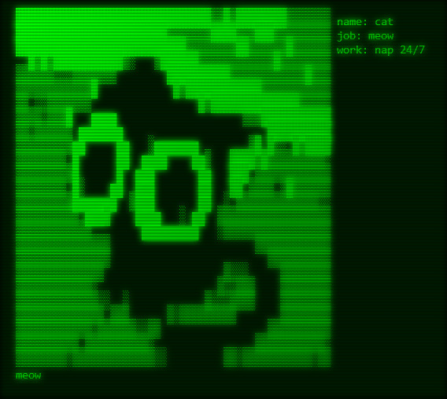

<h1 align="center">ASCIIBIDI</h1>

  

  <strong>A simple app to download ASCII art with added features like customizable information display.</strong>

---

## 🎨 Features

- **ASCII Art Display**: Upload or input ASCII art and display it in the terminal style, supporting various characters for a rich visual experience.
- **Invert Brightness**: Switch between regular and inverted views to change the visual tone of the ASCII art.
- **Custom Information Fields**: Add custom fields like form data to be displayed alongside the ASCII art.
- **Download Image**: Download the ASCII art as a glowing, retro-style image with scanlines.
- **User-Friendly UI**: Simple, interactive interface for easy manipulation of the ASCII art and its display.

## 🛠️ Technologies Used

- **React**: A modern JavaScript library for building user interfaces with reusable components.
- **Tailwind CSS**: A utility-first CSS framework for building fast, responsive designs.
- **Canvas API**: Used to render ASCII art and effects on the canvas for downloading as images.
- **Shadcn UI**: A set of components and utilities to build modern and accessible user interfaces.
- **Lucide Icons**: A collection of customizable, modern icons for a sleek interface.

## 🚀 Getting Started

1. **Clone the Repository**: `git clone https://github.com/MishanPoudel/asciibidi.git`
2. **Navigate to the Directory**: `cd asciibidi`
3. **Install Dependencies**: `npm install`
4. **Start the Development Server**: `npm start`
5. **Open Your Browser**: Visit `http://localhost:3000` to use the ASCII art display tool.

## 🧑‍💻 How to Use

- **Display ASCII Art**: Input or upload ASCII art and it will be displayed on the page in a terminal-like format.
- **Invert Brightness**: Toggle between normal and inverted brightness for different visual styles of the ASCII art.
- **Custom Fields**: Add custom fields (e.g., text, data) to be displayed alongside the ASCII art for added context or personalization.
- **Download**: Click the download button to save the displayed ASCII art as a retro-style image with a glow effect and scanlines.

## 🖼️ App Demo

  
  
  

## 🤝 Contributing

We welcome contributions! If you have suggestions for new features, bug fixes, or improvements, feel free to submit an issue or pull request. Let's make the ASCII Art Display app even better together!

## ⭐ Support

If you find the app useful, please consider giving the repository a star! Your support helps us keep improving and adding new features.

  

